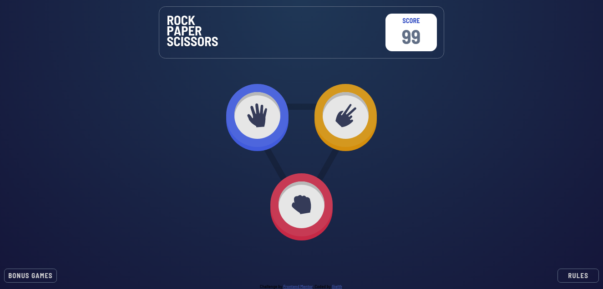
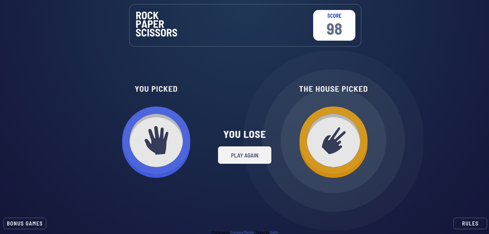
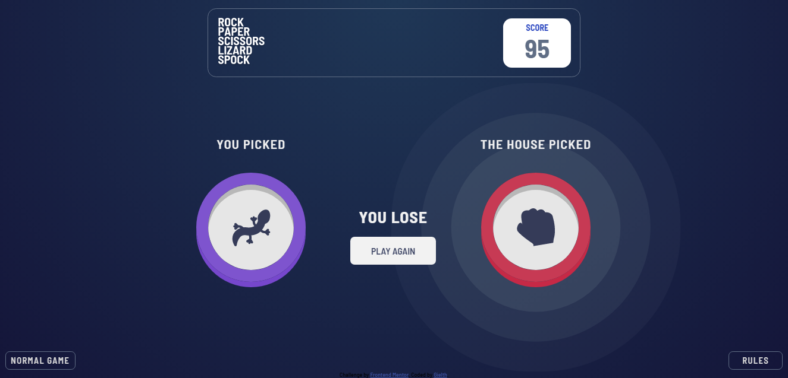
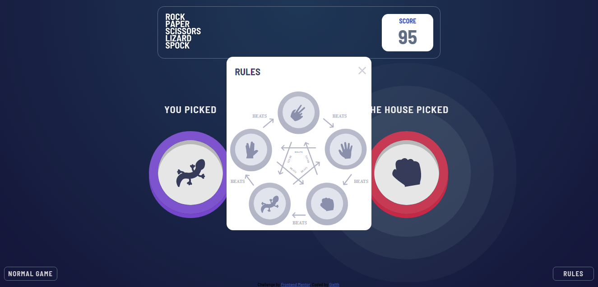

# Frontend Mentor - Rock, Paper, Scissors solution

This is a solution to the [Rock, Paper, Scissors challenge on Frontend Mentor](https://www.frontendmentor.io/challenges/rock-paper-scissors-game-pTgwgvgH). Frontend Mentor challenges help you improve your coding skills by building realistic projects. 

## Table of contents

- [Overview](#overview)
  - [The challenge](#the-challenge)
  - [Screenshot](#screenshot)
  - [Links](#links)
- [My process](#my-process)
  - [Built with](#built-with)
  - [What I learned](#what-i-learned)
  - [Continued development](#continued-development)
  - [Useful resources](#useful-resources)
- [Author](#author)
- [Acknowledgments](#acknowledgments)

**Note: Delete this note and update the table of contents based on what sections you keep.**

## Overview

### The challenge

Users should be able to:

- View the optimal layout for the game depending on their device's screen size
- Play Rock, Paper, Scissors against the computer
- Maintain the state of the score after refreshing the browser _(optional)_
- **Bonus**: Play Rock, Paper, Scissors, Lizard, Spock against the computer _(optional)_

### Screenshot







### Links

- Solution URL: [Github Repository](https://github.com/Gielth/frontendmentor-rock-paper-scissors)
- Live Site URL: [Live Site](https://gielth.github.com/frontendmentor-rock-paper-scissors)

## My process

### Built with

- Semantic HTML5 markup
- CSS custom properties
- Flexbox
- Desktop-first workflow
- JavaScript Vanilla
- CSS Keyframes Animations

### What I learned

This was a very interesting project to work on, it was quite the challenge, although I suffered and couldn't do some stuffs that I do wanted to do, I learned a lot through this experience, not only I saw that I understand most of the intermediate and a few advance concepts of html, css and javascript

A few things that I learned through this challenge was, the use of the localStorage, understand animations with css, how they work, how to create and set-up them, and how to use them, complete understand of the uses and creations of modals through vanilla concepts in css and javascript.

This are a few of the thing in the code that I most proud of:


```css
@keyframes easy-in-rock {
    0% {
        box-shadow: 0 10px 0 hsl(349, 71%, 52%);
    }

    100% {
        box-shadow: 0 10px 0 hsl(349, 71%, 52%), 0 0 0 3.5rem hsla(217, 16%, 45%, 0.3), 0 0 0 7rem hsla(217, 16%, 45%, 0.2), 0 0 0 10.5rem hsla(217, 16%, 45%, 0.1);
        z-index: -1;
    }
}
```
```js
rulesButtonOpen.addEventListener('click', () => {
	rulesSpace.setAttribute('opening', '');
	rulesSpace.style.display = 'block';
	setTimeout(() => {
		rulesSpace.removeAttribute('opening');
	}, 250)
})
```

### Continued development

I'm still will be working on this project for a few aditions, such as, fine tunning some animations, such as the game results screen with showing opening that more smothly.

And still working on trying to unite the whole game selection screen in only one section, instead of having two sections one for each game, in a way that I have only one of the rock, paper and scissors ID... the way I worked it in, is functional, but is not the best way to make.

### Useful resources

- [mdn web docs_](https://developer.mozilla.org/en-US/docs/Web) - This was the main place where I looked through specific "functions" that i was looking to implement my designs, such as css properties, js DOM manipulation, or specific reasons
- [w3schools](w3schools.com) - This was another one of my most used place to look for specific ways to understand a few things and how they work, such as the modal work.


## Author

- Github - [Gielth](https://github.com/Gielth)
- Frontend Mentor - [@yourusername](https://www.frontendmentor.io/profile/gielth)